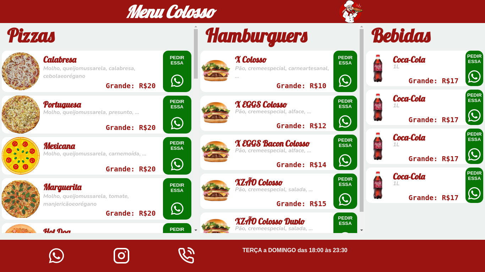
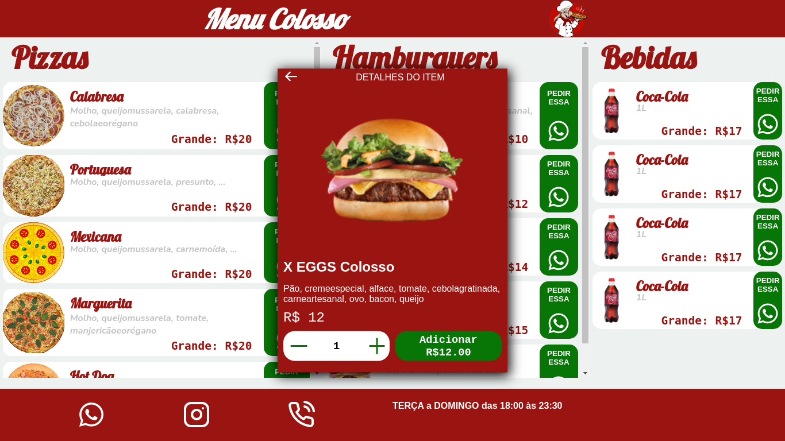
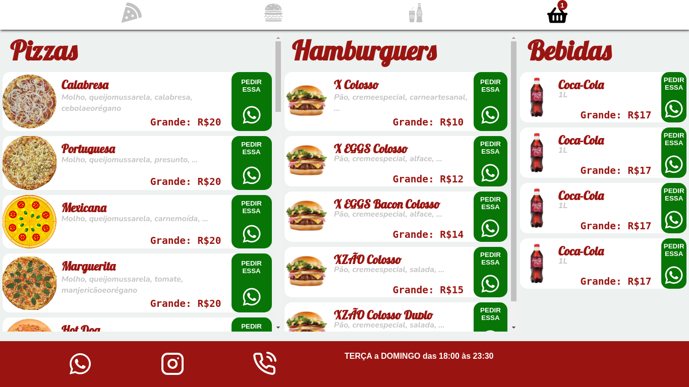
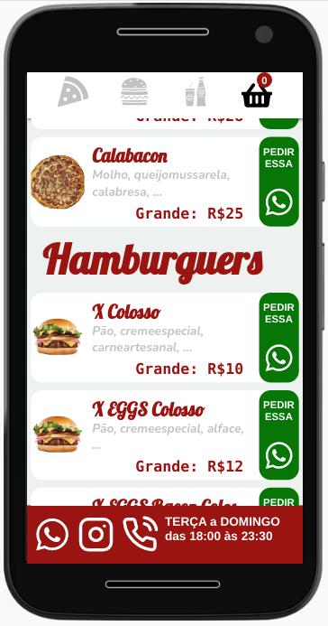
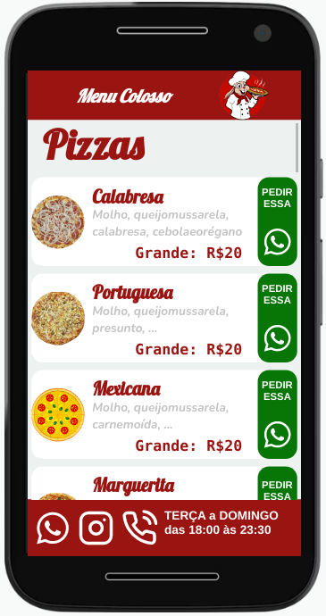

# Digital Menu
Cardápio online de fácil gerenciamento. Aplicação web para apresentar um cardápio de lanchonete de forma online e com redirecionamento dos pedidos para Whatsapp. O cardápio é gerenciado por uma planilha (Google Sheets), na qual mudanças na planilha refletem nos dados do cardápio.


Cardápio: [Google SpreadSheet](https://docs.google.com/spreadsheets/d/1Hrhw7xC5NFxNyblD7aZ7afD1DFzHlSsQidav0e6Hshw/edit?usp=sharing)

Página: https://pizzariacolosso.github.io/digital-menu/

## Screenshot

<p align="center" display="flex">
  
  
  
</p>

<p align="center" display="flex">
  
  
  
</p>

##  Observação
Como não é usado uma API personalizada para aplicação, os dados do cardápio podem se torna inacessível caso o google remova ou altere a URL de obtenção dos dados.

## Project setup
* :pushpin: **
* :pushpin: **

### Run

```
docker-compose up --build
```
